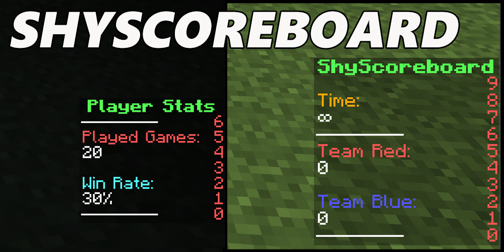

# ShyScoreboard

ShyScoreboard is a modern, high-performance scoreboard plugin for Bukkit and Folia based Minecraft servers. It provides smooth, non-flickering scoreboards with extensive customization options and multiple display modes.

## ✨ Key Features

### Core Features
* **🚀 Performance Optimized**: Fully asynchronous processing with zero server lag
* **📱 Non-Flickering Display**: Smooth scoreboard updates without visual glitches
* **🎨 Rich Customization**: Support for HTML color codes and PlaceholderAPI integration
* **📏 Extended Lines**: Support for unlimited character lines

### Display Modes
* **🌍 Global Scoreboards**: Always visible with proper permissions
* **⚡ Command-Based**: Show/hide scoreboards dynamically via commands
* **🛡️ WorldGuard Integration**: Automatic display based on region entry/exit

### Compatibility
* **📦 Server Support**: Bukkit and Folia compatible
* **🔌 Plugin Integration**: PlaceholderAPI and WorldGuard support
* **🎯 Version Range**: Supports Minecraft 1.8.R1 through 1.21.R7

## 📚 Documentation

* **[Configuration Guide](installation.md)** - Step-by-step setup instructions
* **[Commands Reference](commands.md)** - Complete command documentation
* **[Permissions](permission.md)** - Permission nodes and access levels

## 💡 Example Use Cases

* **Server Hubs**: Display server info, player count, and announcements
* **Minigames**: Show game stats, time remaining, and player rankings
* **Survival Servers**: Display player stats, economy info, and server events
* **Faction Servers**: Show faction info, territory details, and war status